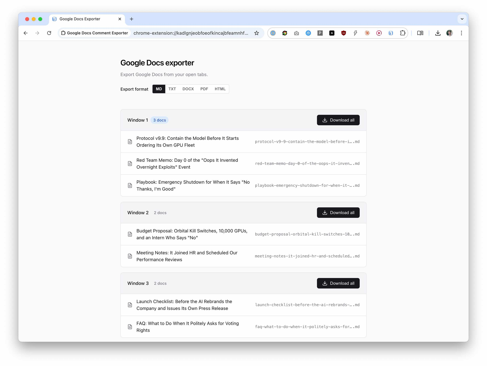

# Google Docs Comment Exporter

A Chrome extension to download Google Docs as text files, including comments.

## Features

- **Download current doc** — One-click download when viewing a Google Doc
- **Batch export** — Find all Google Docs across all open tabs and download them all at once
- **Format selection** — Export as `docx`, `txt`, `md`, `pdf`, or `html`
- Uses Google's native export endpoint, which includes resolved comments in the exported text

## Installation

1. [Download](https://github.com/HartreeWorks/extension--google-docs-comment-exporter/archive/refs/heads/main.zip) or clone this repository
2. Open Chrome and go to `chrome://extensions/`
3. Enable **Developer mode** (toggle in top right)
4. Click **Load unpacked**
5. Select the extension folder

## Usage

1. Click the extension icon in your toolbar
2. Choose an export format
3. If you're on a Google Doc, click **Download current doc** to export it
4. To batch export, click **Find Google Docs in all tabs**, then **Download all**

Files are saved with sanitised filenames based on the document title and the selected format.

## Requirements

- Google Chrome (or Chromium-based browser)
- You must be logged into Google with access to the documents you want to export

## How it works

The extension uses Google's built-in export endpoint (`/export?format=...`) for each file type. Markdown uses `format=markdown`. The text export includes resolved comments; other formats use Google's standard export output.

## Permissions

- `activeTab` — To detect if the current tab is a Google Doc
- `tabs` — To find Google Docs across all open tabs for batch export
- `downloads` — To save exported files to your computer

## Licence

MIT
